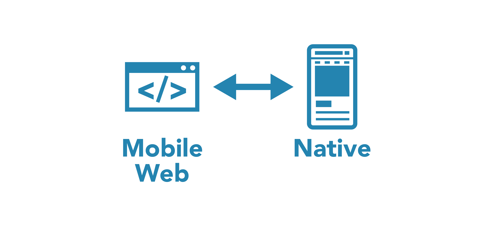
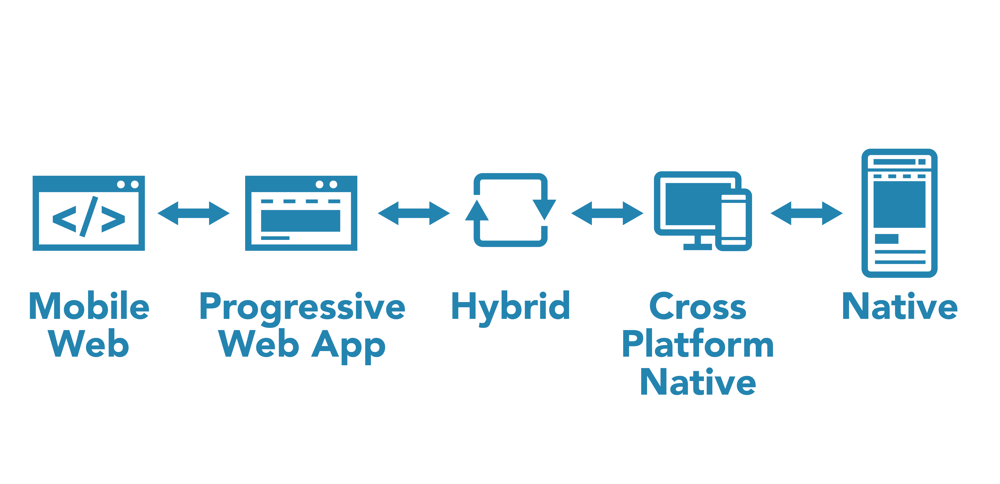
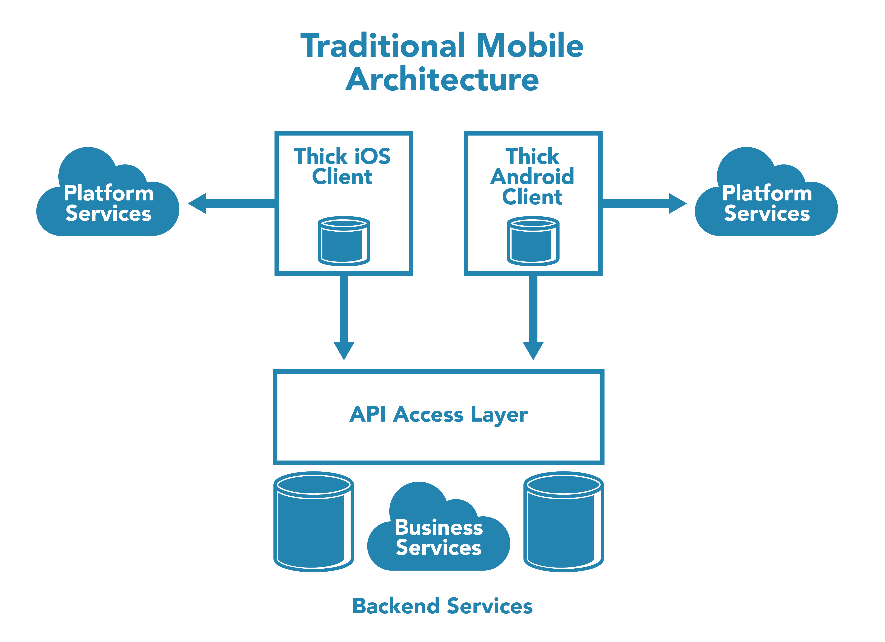
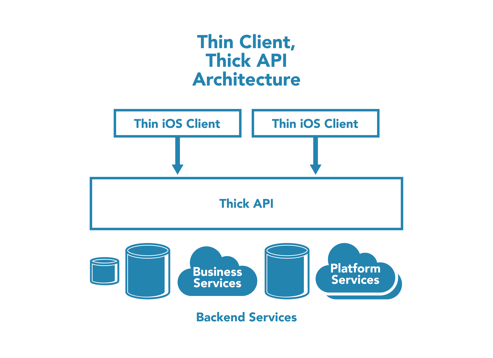

# MOBILE APP DEVELOPMENT TRENDS

# Key Trend: There are New Options

Until the last several years, there was a binary decision to be made between developing native mobile apps for each mobile platform (at least iOS and Android, possibly others) or relying on a responsive, mobile web application to bring your functionality to website visitors inside a mobile web browser. This decision was governed by the significant limitations of mobile web apps and mobile browsers, and by the significant time and expense of having multiple native mobile app development efforts.

Several new developments have made this decision more complex. There are now hybrid options in between the two traditional choices.

It’s important to understand each of these, both where things currently stand with the original choices, as well as the newer alternatives.

### Mobile Web

The viability of responsive mobile web apps has continued to increase, largely due to faster mobile device CPUs, better mobile JavaScript interpreters, and the increased robustness of web frameworks (e.g., React and Angular) to build full-featured, client-centric web apps (client centrality is a requirement for Progressive Web Apps, see below).

It’s never been easier, or less-expensive (in both time and cost), to develop the equivalent functionality of a native app in a mobile web browser. But that’s not to say it’s particularly easy or inexpensive to do. It largely depends on what the goal is. The closer to a native app experience you try to achieve with mobile web technology, the closer the time and expense is to native app development. In fact, trying to achieve a perfect match to a native app experience on any given platform using mobile web technologies isn’t actually possible today, and the attempt will ultimately cost more than developing a native app for the platform.

Why is there still a gap between what can be done on mobile web and with a native app? Though continued progress has been made in performance and in exposing device features to mobile apps such as location, audio/image/video capture, multi-touch, gesture and inertia input, app launching, and payments, there *hasn’t* been the same progress in making mobile web apps *feel* native to mobile users. Even if specific hardware access or platform SDK access *isn’t* required by an app, there *still* remains an insurmountable gap in feel that can jeopardize this approach.

Ultimately user expectations may dictate a presence on the mobile home screen and that certain key mobile app functions be present, which brings us to our first hybrid option, the Progressive Web App (PWA).

### Progressive Web Apps (PWA)

The next step towards embracing a mobile platform directly is to utilize recently developed mobile web extensions, creating what is known as a Progressive Web App. PWAs have been [embraced by the Android ecosystem](https://developers.google.com/web/progressive-web-apps/), and Apple has followed suit in the iOS ecosystem (but with less enthusiasm, particularly in the area of access to device notifications).

The idea behind a PWA is to provide some important missing capabilities to mobile web apps that would otherwise require a native application.

* Home screen presence

* Resource caching, fast load

* Load screen

* Offline support

* Service worker threads off the main UI thread

* Push notifications (some limitations, including substantial ones on iOS)

However, important gaps remain with PWAs that need to be considered by product teams:

* Access to mobile app store distribution

* Access to device hardware and platform SDKs outside the scope of the PWA definition

* True native feel to the UX

* Native level of performance

The PWA is still a relatively rare thing for users to encounter, and many users have no experience using them. It’s not clear that less technically savvy users will understand or be comfortable with the PWA installation sequence. Ultimately user expectations may dictate distribution through an app store, which brings us to our next hybrid option, the hybrid mobile app.

### Hybrid Mobile Apps

The next option along the hybrid spectrum brings us to the first choice that results in a traditionally distributed mobile app. The hybrid mobile app approach is to take a client-centric mobile web app, a PWA essentially, but rather than running it in the device browser as a result of a website visit, instead its hosted in a WebView inside a generated native container app. The resulting app is distributed to users via a mobile app store.

Hybrid apps have been with us for some time, and there are numerous options and frameworks that target different web development technologies (Angular, React, and various mobile UI-centric frameworks). They also provide varying amounts exposure of wrapped native SDKs.

Developing a hybrid mobile app uses web technologies (particularly HTML, CSS, and JavaScript) to create a non-web mobile app experience. This choice is largely about reusing developer skills rather than reusing an existing mobile or responsive website. There’s opportunity for common shared code and code reuse between a responsive mobile website and a hybrid mobile app, but it tends to be less than you’d expect if the intent is to fully embrace the creation of a near-native experience in the app.

The primary advantage of hybrid apps are:

* Access to app store distribution

* Single cross-platform codebase

* Access to additional device hardware and SDKs through API wrappers

* Option for targeted native extensions to tap into all of the device hardware and SDK

It’s worth noting that despite typically using just one codebase to target multiple mobile platforms (e.g., iOS and Android), the more native the app feels, and the more native features the hybrid app takes advantage of, the more platform specific code and styling will exist in the hybrid app, increasing its complexity.

Many of the downsides of having a native app vs. utilizing the open web exist with a hybrid mobile app include:

* Overhead of submission to multiple app stores

* Gated release cycle through app stores

* Subjugation of authority to the app store owner

Ultimately the WebView as a UI container shares most of the same drawbacks as with both PWAs and mobile websites in its inability to faithfully mimic the feel and performance of a native app. There remains an uncanny valley, and users know when they are using web technology in an app.

Ultimately user expectations around app performance and feel may dictate abandoning web technologies, which brings us to our last of the hybrid options, the cross-platform native app.

### Cross-platform Native Apps

The next option on the hybrid spectrum is to eschew web technology (namely HTML, CSS, and JavaScript) as the building block components of the UI, and instead embrace native app development.

The key distinction of this option, however, is the rejection of independent development efforts to target each mobile platform (e.g., iOS and Android). Rather than targeting the native UI SDK of the platform, using the native programming language of the platform, this option uses a cross-platform UI SDK and a cross-platform language to develop a single native app codebase that targets different platforms.

One of the most viable cross-platform options has been [Xamarin](https://en.wikipedia.org/wiki/Xamarin). Xamarin is a proven solution from an independent company that’s owned by Microsoft, and is especially suited for Microsoft/.NET development teams coming to Android and iOS with a C# background.

An emerging option, the [Dart language](https://en.wikipedia.org/wiki/Dart_(programming_language)) with the [Flutter framework](https://en.wikipedia.org/wiki/Flutter_(software)) is supported by Google, and used to develop their own cross-platform apps. This option has more technical risk due to a shorter track record and younger codebase, but is more suitable to development teams coming to Android and iOS mobile development with a dynamic language background, such as Python or Ruby.

It’s worth noting that there are quite a few other mobile cross-platform native approaches focused on allowing cross-platform mobile development in particular languages (Java, Python, Ruby, etc.), but these come with substantial technical risk. The development communities are small and the projects longevity tends to be either already-in-question or at long-term risk. The VA should be cautious of pursuing cross-platform native approaches that don’t have major backing from a substantial application vendor with a vested interest in its own cross-platform mobile apps, as is the case with Xamarin and Dart/Flutter.

Ultimately user expectations around native feel, or developer friction in not participating in the primary ecosystem for the platform could lead to a decision to pursue traditional native app development.

### Targeted Native Apps

The final option is to develop full native applications. A fully native app targeting the mobile platform directly is a no-compromise solution, that in many cases will not be any more expensive than the other options presented, except for the glaringly obvious point that it requires targeting two different mobile platforms with independent codebases, one for Android and one for iOS.

In order to offset supporting just one codebase, the native approach must offer some benefits that are important to the product being developed. These come in the form of the rich platform services available (SDKs for biometrics, voice assistants, speech, messaging, AI, watches) and hardware capability access (screens, input mechanisms, sensors, GPUs, AI chips) with no impedance mismatch. Native app development offers a friction free development approach that is nestled in the heart of the platform’s development ecosystem.

Unlike mobile web development and all the hybrid approaches discussed above, native app development doesn’t specifically aim to leverage development skills from other domains.

For Android, this means development with [Kotlin](https://en.wikipedia.org/wiki/Kotlin_(programming_language)), Google’s preferred language for targeting the Android mobile platform. Java developers with some Android experience will easily transition to Kotlin.

For iOS, native app development today uses the [Swift programming language](https://en.wikipedia.org/wiki/Swift_(programming_language)), Apple’s preferred approach, though Objective-C/C++ developers with some iOS experience will pick up Swift swiftly.

# Key Takeaway: The Perennial Questions Remain the Same

Despite the march of mobile app development progress and new approaches, the same perennial questions that have long guided the decision between mobile web and native app development still persist as the key deciding factors today.

### Seamless Updates vs. App Store Discoverability

Distribution, distribution, distribution.

Frequency of updates is a key factor that can push you away from mobile app store distribution towards the continual updates of mobile web, PWAs, and some mobile hybrids.

Another important consideration here is existing Veteran behavior. If users are conditioned to, and expecting to go to the website first on their mobile device, then there’s more flexibility. A first-class-mobile-app-like experience for the website visitor can leave the Veteran never even considering the need for a native app. The website can also serve as an onramp to a PWA.

If a significant portion of Veterans’ existing behavior is to first go to a mobile app store, and then resort to other channels when they don’t find what they need (phone calls for example), then the mobile app store still represents a critical distribution point that mandates the presence of at least a hybrid mobile app.

Ultimately, for a PWA, we have to ask, will Veterans understand that they can "install" the VA website and have it behave just like a mobile app?

Do note that Apple removed the formerly useful add-to-home-screen-mobile-web-action convenience, which is now a step removed behind the share dialog, making PWA "installation" on Safari/iOS less friendly and less likely.

### Availability of Necessary Mobile Device Functions and SDKs

Can a given development approach access the needed mobile functionality to deliver on the product vision? The gap closes, and then the gap widens again. The web and hybrid development options presented here continue to leap forward, even if progress can seem slow at times, in an attempt to close the gap between the important platform SDKs that are available and what can be utilized in the particular hybrid approach. It’s a game with no-end state, however, since each year the mobile platforms continue to expand and innovate, providing an ever-moving target for non-native development approaches to chase.

It’d be futile in this report to catalog the exact coverage of platform SDKs to various development approaches, as it’s dependent on so many details of implementation choices, it’s fluid in time, and the SDKs that matter are project dependent. We can make some very broad and imprecise statements about the state of things late in 2018 that can provide a flavor for where things stand today.

**Web and Cross-Platform Access:**

* Camera

* Location

* Maps

* Calendar (write)

* Motion sensing

* Gestures

* Payments

* Push notifications (Android)

**Native SDKs Only (may or may not be wrapped and exposed in various approaches)**

* Biometric authentication

* Calendar (read)

* Contacts

* Voice assistants

* NLP/machine Learning

* Push notifications (iOS)

* App loading screen

* Messaging

* Speech/voice

* AR/VR

* Native graphics (animation, image, game, shaders, PDF…)

* Bluetooth

### User’s Perceived Feel and Performance

Finally, a dominant question in mobile app development has always been, can we make the app feel right to the user? What are the users expectations and tolerances? What message will our app’s feel send? Is it the message we want to send? These are important questions that product and technology people on mobile app development teams wrestle with when deciding on their mobile app development approach.

The technical answers to these questions are a factor of providing a native or native-seeming UI that follows the platform’s UI guidelines, and that looks and behaves like the system apps and other ubiquitous apps that users are also using on the platform. Performance is another key technical variable that strongly impacts users’ perception of the app, as is the app’s behaviour in challenging and unusual network environments (is the app merely blank when there’s no or slow network, or is it clearly there, but reporting connectivity challenges, or is it fully functional with cached data?). Finally, the app taking advantage of, or ignoring the platform’s various extra-app affordances (notifications, lock screen, voice assistant, battery conservation, background services, watch support, calendar, contact, and app integration) can impact a users perception of the app as minimal or premium.

The product answers to these questions are about the user and the brand and the expectations the user brings to their interactions. Progress can be made in answering these questions with interviews, focus groups, competitive analysis, and various analytics and survey approaches.

# Key Takeaway: Native Performance and Feel is the Deciding Factor in the Private Sector

Despite all the advances in non-native mobile development techniques, the user can still feel the difference between a native app, a cross-platform native app, a hybrid app, and a PWA or mobile website. They each have a different performance profile, a different match to platform expectations, and they each send a different message to the user. There’s not a bad vs. good message here, but they are different messages, and that message can often be a deciding factor in which approach is used.

In evaluating flagship mobile apps in the private sector (largely healthcare, insurance, and financial services), and in discussions and community participation with development and product teams (largely informal),  it’s clear that these brands universally chose to send a premium message with a native-first approach. That’s not to say every last bit is developed natively to the platform, but it’s clear that they pick the spots where it’s OK to use the web, and where they need to be seen as cutting edge, and they tend to make these distinctions clear to the user, usually not going to great lengths to disguise their web presence within their apps.

# Key Trend: Mobile Development is Entering a 3rd Phase

The initial phase of mobile development was a massive land grab to place products and brands into the greenfield space of mobile app stores and empty mobile home screens. The initial development options were largely limited to platform specific native apps using Objective-C/C++ on iOS and Java on Android.

After some years, organizations were able to evaluate their early mobile performance, and existing technical communities were able to pivot their focus to mobile. Concerns about mobile development costs and time-to-market, and a desire to leverage existing skills led to a 2nd phase of mobile development. This 2nd phase sought time and cost reductions from cross-platform solutions, and existing skills reuse from hybrid apps. Both the perception and the reality of less expensive mobile development projects led to a proliferation, really a saturation, of mobile apps. This saturation produced fatigue on both sides of the marketplace, with the organizations and brands trying to manage so many mobile offerings, and with consumers facing an overwhelming choice in app stores and overflowing mobile launch screens on their devices.

The 3rd phase of mobile app development is a reaction to this app fatigue. After experimenting with dozens of single purpose apps, many organizations are undergoing app consolidation around a premium flagship app. For their part, mobile users are downloading and using less apps than during the app proliferation that marked the 2nd phase. There’s now an understanding that users will rarely use more than 25 apps. The new race is to be relevant enough to more discerning and experienced users to earn a spot in their top apps.

Most users are approaching a decade of experience with smartphones. The emphasis of this 3rd phase of app development is on building premium native apps that meet these discerning users increasing platform integration and quality expectations.

Luckily, the timing does seem right for native development projects as both Apple and Google have successfully transitioned their developer ecosystems to Swift and Kotlin respectively. These new languages are coupled with much refined and more powerful platform SDKs. Native app development has never been more capable or productive.

In addition, the back-end development needed to support mobile apps has matured considerably. Mobile back-end platform-as-a-service (PaaS) and serverless options can be  combined with "thin client, thick API" architectures to drive additional developer productivity.

# Key Takeaway: There are Smart Ways to do Native App Development

## Blended Approach

All the parts of a native app shouldn’t be created equally.

In approximate terms, mobile app usage follows a Pareto distribution where 80% of the user interactions and value in mobile apps are focused around just 20% of the functionality.

Development teams should look to to optimize the performance and native feel of this 20% of the application, and can then consider supplementing the app with web views and other hybrid approaches for all the other edge cases and ancillary paths and functions that represent the other 20% of the app usage but 80% of the total footprint.

Users have proven to be quite tolerant of the non-native portions of native apps, especially when the separation is clear, concise, and sensical. In other words, don’t try to fake it. Make the critical user interactions native, and make the tertiary functions of the app clearly a mobile web experience.

## Thin Client, Thick API Architecture

Native mobile app development is often based on an architecture similar to the one shown below. Substantial code and logic, beyond what is minimally needed to invoke the native platform UI and SDK services, is developed in a thicker than necessary client. Numerous services are accessed directly by the client in client dependent ways (be they formats, protocols, libraries, etc.) and data, configuration, user profiles, etc. are kept locally in the app in platform specific-data solutions. The end result is a relatively shallow, shared common API, and substantial functionality locked up in each client, in platform specific code and approaches.

This traditional native mobile architecture isn’t easy to avoid, and it isn’t due to poor architectural decisions by the development teams. It’s more attributable to the structure of the project, and the independent nature in which each mobile platform is each targeted.

At best, these native mobile clients tend to be developed as independent development streams done at the same time, in the same organization, but more often the two mobile platform teams are much more isolated than that. They tend to be isolated in time (develop for one platform first and another platform later) and by organization (develop against one platform internally and contract out the other, or contract out both to separate organizations).

These project decisions can all but prohibit the development of a superior architecture for native development, the thin client, thick API architecture. With this approach, a single development team is tasked with developing a solution targeting multiple mobile platforms, exactly as you would do if you were using a mobile web, hybrid mobile, or native cross-platform development approach.

A strong development team working on a native mobile development project under these more ideal conditions will be able to leverage a thin client, thick API architecture. They can minimize data storage and direct service access in the mobile clients, and keep the unshareable aspects of the native clients as thin as possible. They’ll be able to spend more time developing common services and business logic, utilized by both clients, and will agree on common formats, protocols and service APIs. Ultimately, they’ll have both the motivation and the opportunity to avoid incidental, rather than essential platform differences.

# Key Caveat: There are VA-specific Considerations

We’re excited to expose these key mobile development trends to the VA, and we expect that the VA’s approach to fulfilling its mission can be improved by learning about trends in the development of flagship mobile applications, but there are important VA-specific caveats to the development trends noted in this document.

These trends have been gathered as key impacts on mobile development in the private sector (healthcare and financial services). The VA can’t afford to ignore these trends, since they directly impact the expectations veterans and service providers have of the VA, but it’s also critical that the VA keeps their unique public mission in mind at all times. There are VA-specific considerations that need to be factored into mobile app development.

* Acceptability of biometric authentication (finger and face)

* App accessibility to aging and disabled Veterans

* Veterans with older devices and technology

* Other form factors (desktop, tablet, TVs, car) and environments (hospitals, libraries)

* Rural/low/no network bandwidth users

* Development and sourcing limitations at the VA that are different than the private sector

Ultimately the VA, the VA’s service providers, and the Veterans themselves are the experts on what impact these considerations may have, and on what other important considerations are missing from this list.

# Further Resources

The following is a list of additional reading about items contained in this report. These items aren’t a bibliography of sources for this report, but instead are a set of potential next steps to explore.

## Mobile Web Apps

* [Mobile Web on Wikipedia](https://en.wikipedia.org/wiki/Mobile_Web)

* [Responsive web design on Wikipedia](https://en.wikipedia.org/wiki/Responsive_web_design)

* [11 powerful examples of responsive web design](https://www.invisionapp.com/inside-design/examples-responsive-web-design/)

* [Adaptive vs. Responsive Web Design](https://uxplanet.org/adaptive-vs-responsive-web-design-eead0c2c28a8)

* [Choose your strategy: Mobile-First Web Design vs. Responsive Web Design](https://darwindigital.com/mobile-first-versus-responsive-web-design/)

## Progressive Web Apps

* [PWA on Wikipedia](https://en.wikipedia.org/wiki/Progressive_Web_Apps)

* [Google / Chrome Progressive Web Apps](https://developers.google.com/web/progressive-web-apps/)

* [Progressive Web Apps: What is it all about?](https://indylogix.com/progressive-web-apps/)

* [A gallery of progressive web apps](https://pwa.rocks/)

## Hybrid Mobile Apps

* [What is a Hybrid Mobile App?](https://developer.telerik.com/featured/what-is-a-hybrid-mobile-app/)

* [The 7 Best Hybrid App Development Frameworks for 2018](https://www.konstantinfo.com/blog/the-best-hybrid-app-development-frameworks/)

* [The Top 5 Hybrid Mobile App Frameworks for 2018](https://www.websoptimization.com/blog/hybrid-mobile-app-frameworks/)

* [Best Hybrid App Development Frameworks in 2018](https://blogs.systweak.com/2018/04/best-hybrid-app-development-frameworks/)

* [Benefits and Disadvantages of Hybrid Mobile Apps](http://brookscanavesi.com/uncategorized/benefits-disadvantages-hybrid-mobile-applications/)

* [React Native](https://facebook.github.io/react-native/)

* [Cordova](https://cordova.apache.org/)

* [Ionic](https://ionicframework.com/)

* [Titanium](http://www.appcelerator.com/mobile-app-development-products/)

* [PhoneGap](https://phonegap.com/)

* [Framework7](https://framework7.io/)

* [Onsen UI](https://onsen.io/)

## Cross-platform Native Apps

* [Xamarin on Wikipedia](https://en.wikipedia.org/wiki/Xamarin)

* [Visual Studio Tools for Xamarin](https://visualstudio.microsoft.com/xamarin/)

* [Dart on Wikipedia](https://en.wikipedia.org/wiki/Dart_(programming_language))

* [Dart](https://www.dartlang.org/)

* [Flutter on Wikipedia](https://en.wikipedia.org/wiki/Flutter_(software))

* [Flutter](https://flutter.io/)

## Targeted Native Apps

* [Kotlin on Wikipedia](https://en.wikipedia.org/wiki/Kotlin_(programming_language))

* [Kotlin](https://kotlinlang.org/)

* [Android Development Platform](https://developer.android.com/)

* [Swift on Wikipedia](https://en.wikipedia.org/wiki/Swift_(programming_language))

* [Swift](https://swift.org/)

* [iOS Development Platform](https://developer.apple.com/ios/)

## Comparisons

* [Native vs. Web vs. Hybrid Apps  --  What’s the Difference? (2017)](https://blog.markgrowth.com/native-vs-web-vs-hybrid-apps-whats-the-difference-1df4c5e4bc50)

* [Advantages and Disadvantages of Hybrid Mobile Apps Development (2017)](https://www.quape.com/hybrid-mobile-apps-development/)

* [Pros and Cons of Native, Hybrid and Web Apps (2016)](https://www.valagroup.com/fi/2016/09/pros-cons-native-hybrid-web-apps/)

* [Native vs. Hybrid App Development (2016)](http://blog.icreon.us/launch/native-vs-hybrid-development)

* [Pros and Cons of Cross-Platform Mobile App Development (2016)](https://www.infoq.com/articles/mobile-cross-platform-app-development)
