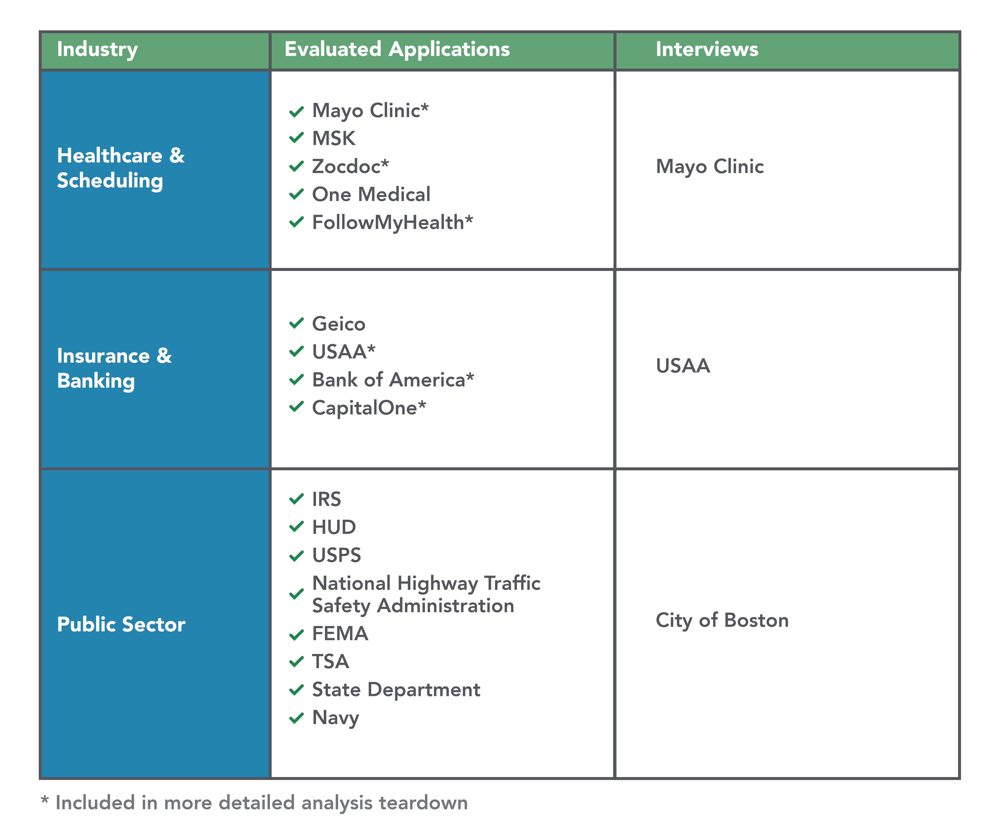
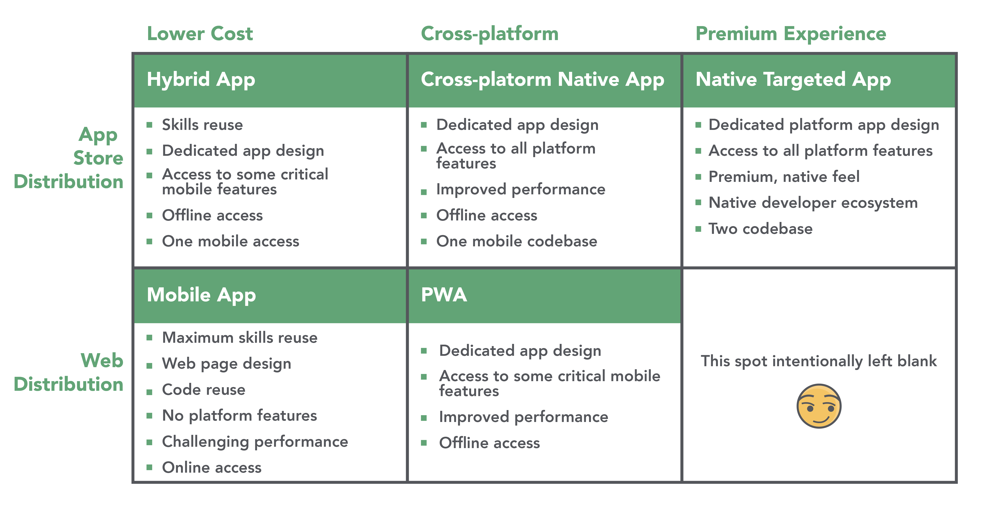

# VA FLAGSHIP MOBILE APPLICATION ANALYSIS SUMMARY

# Introduction

In the private sector, the majority of large, consumer-facing organizations deliver flagship native iOS and Android mobile applications built on top of their APIs (e.g., Bank of America, Geico, USAA).

As the VA builds out its API ecosystem, it’s exploring the possibility of creating a flagship mobile application to allow Veterans, service members, caregivers, and dependents the ability to perform their most common interactions with VA as easily as possible on mobile devices.

## What is a Flagship Mobile Application?

"Flagship mobile application" is a naval metaphor. The flagship of a fleet is the lead ship, usually the largest, fastest, newest or most powerful ship, the ship where the commander of the fleet serves. The name is because that ship flies the commanding officer’s flag.

In this use with mobile apps, the term is borrowed even further from hardware product lineups, where the flagship device is the most expensive option in a product line, and carries the latest and greatest features the brand has to offer. In mobile app terms, a flagship app is the premiere app of a brand. It’s an app for consolidation of multiple use cases from multiple user personas. It often carries the brand’s name unadorned with a specific use case attached to it. It’s either the only app, or at least the default app for a brand.

## The Goal

The purpose of this analysis is to begin to answer some questions the VA has about pursuing the creation of a flagship mobile application:

* What is the most common approach in the private sector when creating native mobile applications that are based on an existing responsive website, and what does VA need to do to follow similar best practices?

* What are the available technical approaches to developing a flagship mobile app, and what criteria are important to deciding on an approach to use?

    * Should the VA build Android and iOS native applications from scratch, and what would the pros and cons of that approach be?

    * Should the VA use primarily WebViews, and if so, which applications or pages should not be WebViews and why?

    * Is there a hybrid framework or approach that VA should use, and if so which one and why?

* Where should VA start and what would be defined as a Minimum Viable Product (MVP)?

## Included Deliverables

**Mobile Application Comparative Analysis:**

* [General Review](mobile_application_comparative_analysis/general_review.csv)

* [Deep Dive](mobile_application_comparative_analysis/deep_dive.csv)

* [Flagship App Technical Tear Down](mobile_application_comparative_analysis/technical_tear_down.csv)

* [Public Sector Applications](mobile_application_comparative_analysis/public_sector_apps.csv)

**Mobile Flagship App Development Analysis:**

* [Mobile App Development Trends](mobile_flagship_app_development_analysis/mobile_app_development_trends.md)

**Interview Scripts and Notes:**

* [Companies and Practitioner Interviews](interview_scripts_and_notes/companies_and_practitioner_interviews/)

* [Veteran Interviews](interview_scripts_and_notes/veteran_interviews/)

# The Research

## Comparative Analysis

Comparative analysis (or often called competitive analysis) is the practice of evaluating a list of competitive or comparable products based on a defined set of criteria. It’s helpful for documenting the landscape of options users have, as well as identifying common patterns and solutions.

The criteria used to evaluate and understand the ecosystem of mobile applications selected was a combination of features, technical capabilities, and an evaluation of the designed user experience. We wanted to understand what Veterans would expect of a VA Flagship Mobile Application based on services they’d find elsewhere, and then define how the VA can meet or beat that standard set by best-in-class, private-sector applications.

## Criteria and Goals

**These are the high-level questions asked of reviewed applications:**

* What primary tasks can a user accomplish on the mobile application?

    * What has been left out of the app -- and is only available in other services?

* What does it do that’s only possible with mobile technology?

    * How does it technically achieve this?

* How is the experience of using the application?

* What particular issues might arise for the Veteran population?

**Interpreting these questions as a list of criteria is reflected as follows:**

* Platform support

* Primary featureset, with special attention to those facilitating contact, scheduling, support, and those only offered in a mobile app (like biometric authentication)

* Notifications

* Offline capabilities

* Payment processing

* Messaging capabilities

* Device integration: camera, contacts, calendar, media access
voice assistants, speech/voice capabilities

**Interview goals and questions:**

* A description of their intent and overview of the application and how it fits into their service ecosystem

* What they’ve learned in maintaining it in terms of team support, delivery across platforms, and customer usage

* Their rationale for building native and responsive features

* What they plan to do moving forward, as well as what they’d do differently

## Evaluated Applications

We evaluated applications at companies working in healthcare, scheduling, insurance, and banking. These applications have been selected both because they’re (1) widely adopted within the industries they represent and (2) are well-regarded for experience, execution, and/or functionality.

Since the VA covers all of these industries, they’re all relevant to what a flagship application could do. While the companies we looked at cover the breadth of services at the VA in aggregate, none cover the expanse of services at the VA. Since the VA’s intent is to bring all features under a common umbrella, our recommendations combine the best of all reviewed and present them combined into one application.

### Public Sector Applications

We compiled a list of public sector applications available. None that we saw were comparable -- in execution or intent -- to what the VA would look towards as a best-in-class example for a flagship application.  

### Technical "Tear Down"

Given the limited access to product team interviews, 6 of the above listed private sector flagship applications (3 in healthcare and scheduling, and 3 in insurance and banking) were evaluated for their technical approach to mobile development. In order to limit distracting variation, the iOS versions of all six mobile apps were evaluated rather than including any Android apps. This was done so that common trends across the 6 apps would be more easily apparent, as extracting those commonalities was the primary goal of the analysis.

The full collected dataset can be found in the [Flagship App Technical Tear Down](mobile_application_comparative_analysis/technical_tear_down.csv) document. Interested parties are *strongly* encouraged to consult the full dataset, but what follows are the distilled findings.

**Comparable flagship apps in the private sector are built natively.** There was a surprising homogeneity to the approach of using the up-to-date vendor standard native mobile app development languages, tools, and libraries. All six of the evaluated flagship iOS applications have been rebuilt at some point in the past few years as modern Swift applications, with minimal cross-platform, web, or legacy (Objective-C or otherwise) elements, and with extensive use of the latest Apple iOS development SDKs. In an interview we learned one of the team’s (Mayo) Android development team follows the same approach with a full-native Java app, and an impending Kotlin rewrite.

**Comparable flagship apps make extensive use of device and OS-specific capabilities.** Four of the six evaluated apps included Apple Watch support. Two included Siri support, and another had custom speech generation and recognition support. Three apps included support for various iOS operating system extensions.

**Comparable flagship apps make extensive use of 3rd-party and open-source software from the native development community ecosystem.** Four of the six applications showed extensive use of the development efforts of the entire platform development ecosystem in the form of both commercial and open source third-party libraries, components and SDKs. Two of the six applications showed very little 3rd-party or open-source use.

# Trends and Guidance

## Design Trends

**Users expect a seamless transition through a service, irregardless platform.** With a few exceptions, they expect functionality to transition across the desktop website, to a phone call, to the mobile app. Content should be available consistently across devices and mobile-only users are projected to continue increasing.

**Some key differences in usage patterns alter the way a user approaches a task on an app versus a website.** People on devices are more transaction-based and generally open an app with a specific task to complete. A few key ways this might surface in the user interface, are:

* They expect to log in immediately if they aren’t already so the app can deliver customized content

* They expect to be alerted of updates on a home screen or by notification rather than navigating to check the status

* They are much more likely to frequently check the status of something like a bank balance, or claim response they are awaiting, than to start a lengthy or cognitively-heavy process like applying for a home loan or changing an insurance plan

* They would log in to an existing account, but not necessarily expect to create a new account on a mobile app

* They expect the app to use their native features that are available like fingerprint login, camera for photo uploads, and app notifications, etc.

### Accessibility, Native Applications, and the Veteran Population

In our interviews with Veterans, general adoption and sentiments around technology had a wide range. Some trends to consider:

**Provider choice is increasing.** Many Veterans have options with their healthcare. They might see their VA physician as a "backup" to their normal care, leading them to have many of the same expectations of the VA as in their private sector medical care.

**Adoption of technology will continue to trend upwards.** While the population of Veterans continues to age, the younger generation with higher adoption of technology will increase. While the older Veteran we interviewed is content to call or schedule all appointments in-person at his local VA, the younger Veteran we spoke with would much prefer to use an app to schedule as well as check results from her appointment, and communicate with her doctor, etc.

**Customization of content will be crucial.** We looked at a variety of navigation systems -- the most comparable in complexity being the USAA. In conversations with their team, customization of content on the home screen was very important. The data they had of mobile usage is also significantly more granular than web usage.

Showing Veterans the information about the services they use -- instead of all the services the VA offers -- and featuring those services prominently without relying on an intensive navigation system to navigate to them will be an important part of making this a good experience.

**With customization, understanding a growth engagement model becomes more important.** In the private sector, customer usage data can be used to inform a "ladder of services," or a “growth engagement model,” with the intention of gaining a user’s adoption across services, and increasing their adoption as a customer. For the VA, this framework would be useful as well. If a Veteran has just been approved for healthcare benefits, for example, they might now benefit from their app walking them through the next step of the process: finding a doctor.

**The importance of offline access.** A use case more prevalent in the Veteran population (likely due to it containing substantial low-income, homeless, transient, or rural populations) is the need to access information with spotty, low-bandwidth, or intermittent connectivity.

Consider a user only able to access the internet at the library: they open a form to apply for benefits while connected at the library, fill it out partially because they’re missing a form that’s at home, and potentially don’t have service through the whole process. How the interface lets them know whether they need to or can save progress through that form, and alerts them to whether or not they can proceed is important.

In order to avoid losing their progress or application, a blend of clear notifications (explaining the apps behavior with current connectivity), better offline functionality and caching, as well as thoughtful ordering can take this from a bad experience to a passable or even good one. The app doesn’t necessarily need to work without connectivity, so much as be very clear with users how it will behave, avoiding situations where they lose progress or are misinformed as to whether their task successfully completed.

This was brought up on multiple occasions in our interviews as an oversight in planning, with development and design teams wishing they’d done more testing or thought through more of how the app would behave when a user lost service. Some of the best private-sector apps we tested simply crashed when they lost service, others seemed to be endlessly loading, some loaded blank pages -- but a couple (Zocdoc as the best) had graceful error handling so users knew what to expect and how to proceed.

## Mobile Development - Key Trends Impacting the VA

A [complete deliverable](mobile_flagship_app_development_analysis/mobile_app_development_trends.md) has been prepared for the VA on trends in mobile development and the impact they have on how the VA should approach developing a flagship mobile app. Interested parties are *strongly* encouraged to consult the full deliverable, but what follows is an executive summary of some key trends and takeaways.

**Key trend - there are new options:** The choices available for mobile app development have broadened considerably in recent years. Our research has found this can largely serve as a distraction when it comes to a flagship mobile app experience, where the full native approach is nearly ubiquitous.

**Key takeaway - the perennial questions remain the same:** Despite the new choices and new mobile development approaches available, the important criteria for deciding the right development approach to take for a given app have remained consistent: app discoverability, availability of necessary device functions and SDKs, and the primacy of user’s perceived "feel."

**Key takeaway - native performance and feel is the deciding factor in the private sector:** The same questions that have long guided the decision between mobile web and native app development still persist as the key deciding factors today: seamless updates vs. app store discoverability, availability of needed SDKs and hardware access, and the user’s perception of the performance and feel of the app.

**Key trend - mobile app development is entering a 3rd phase:** The 3rd phase of mobile app development is a reaction to app fatigue. After experimenting with dozens of single purpose apps, many organizations are undergoing app consolidation around a premium flagship app. There’s now an understanding that users will rarely use more than 25 apps. The emphasis of this 3rd phase of app development is on building premium native apps that meet discerning users’ increasing platform integration and quality expectations.

**Key takeaway - there are smart ways to do native mobile app development:** Once a product team has decided to pursue developing a mobile app, it doesn’t mean the decisions about the approach are then complete. A blended approach covers the primary use cases and user interactions natively, and then supplements these with in-app mobile web experiences for less common uses and edge cases. Similarly, once a product team has committed to separate iOS and Android development streams, it doesn’t mean collaboration between the two teams is limited. Ideally there is actually one team and one development project which is developing a shared thick API and two thin native clients.

**Key caveat - there are VA-specific considerations:** Our analysis of comparable private-sector applications needs to be strongly tempered by many VA-specific considerations. We saw little evidence in analyzed comparable apps of care and concern paid to many VA specific concerns such as: special needs accessibility, challenging network connectivity, older and outdated device support, and federal laws that may guide the VA in areas such as identity authentication or privacy.

# Recommendations for the VA

Despite many new development options, our technical analysis of flagship mobile apps in the healthcare and financial services industries, and product team interviews, show an overwhelming preference for traditional, native mobile app development of flagship apps. This is attributed primarily to user expectations for app "feel" as well as extensive needs in flagship apps to access native features of the device.

## Features and MVP

Below is a chart of different features the VA would include in a flagship application, based on current offerings both at the VA and in comparable applications. This is intended to answer the questions: *What should we build?* AND *What should we build first?*

The columns below are designed to help develop a framework for what and when to build a user-facing feature based on all of the criteria we’ve outlined above. The technical approach should inform how it’s built.

**User Action or Feature:**

This column describes what the feature or user action is, grouped by type.

**Italicized** = Suggested feature if not already built at the VA

**MVP:**

This describes how crucial a feature is when launching an initial application, with the assumption that not everything can be built at launch. There are three tiers: &#10004;, v2, and x, described below.

**&#10004;** = Suggested to build natively for first launch

**v2** = Suggested to gauge usage and user patterns, launch in later version and use responsive functionality for MVP

**x** = Doesn’t seem crucial to build this content natively due to functionality or importance for mobile users

**Platform Requirements:**

This column outlines native or platform features that should be utilized in the application.

**Fallback Support:**

The implementation of items in this column depends on the technical approach. Here it’s labeled as "Fallback Support," and that simply indicates that either the content doesn’t require a premium feel, or advanced functionality, or it remains a question whether it would be widely adopted or frequently used in a mobile application. A product team would likely decide to support this in a secondary fashion (hybrid web view or in-app responsive mobile web) or not include it at all.

## Technical Options and Recommendations

The decision for the technical approach to creating a new flagship mobile application for the VA is both incredibly important and complex. It isn’t something that can be definitively answered in the context of this report. It requires more information and decisions about the VA’s goals, objectives and constraints, the Veteran’s needs, and the VA’s organizational and development capabilities. This report lays a foundation for those necessary next steps.

It’s also not a purely technical question. The right technical approach will reflect a compromise between the requirements of the Veterans using the app and the VA’s ability to deliver an effective solution in a timely and cost-effective manner.

A more detailed description of the current options for mobile app development has been provided in a [dedicated deliverable](mobile_flagship_app_development_analysis/mobile_app_development_trends.md). What follows is a decision framework for guidance in choosing among the mobile app development options presented there.

Regardless of what mobile app development approach is chosen by the VA to implement a flagship mobile application, we can strongly recommend a thin client, thick API architecture and a blended approach to feature creation. More detail on these two recommendations are in the [dedicated deliverable](mobile_flagship_app_development_analysis/mobile_app_development_trends.md) and interested parties are *strongly* encouraged to read more there.

# Conclusion

The VA has an opportunity to leverage its growing API ecosystem to create a flagship mobile application that will allow Veterans, service members, caregivers, and dependents to perform their most common interactions with VA on mobile devices.

The decision to create a flagship app or not is neither obvious nor easy. There are many factors to consider, such as app discovery, and which are the most important use cases and features to include initially, those to follow with, and those to exclude. There are also difficult decisions to be made about the correct design and technical approach that will result in a flagship app that meets the VA constituents’ needs, and embraces the strengths and overcomes weaknesses of the VA’s technical delivery capability.

This is an exciting moment for the VA, as it seeks to transition digital service delivery to a predominantly mobile first and mobile only constituency. There’s the potential to participate in the 3rd phase of mobile app development, one that’s marked by app consolidation around a premiere flagship mobile application, or to instead embrace the open web and a mobile-first design approach to delivering digital services over the web.

The research and recommendations provided here have covered the VA’s needs, comparable private organizations delivery choices, and the most important mobile design and development trends. It’s now up to the VA to use this information to make decisions and push forward on the important work of mobile service delivery.
